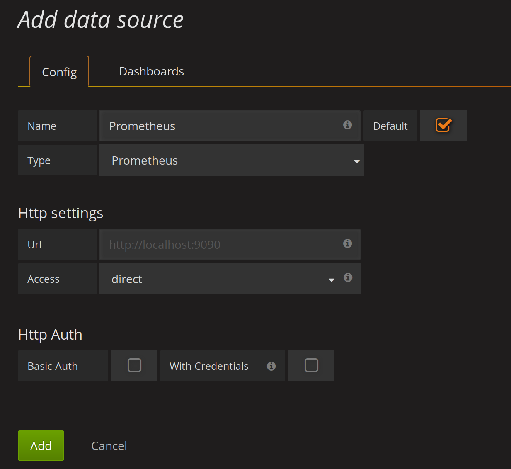
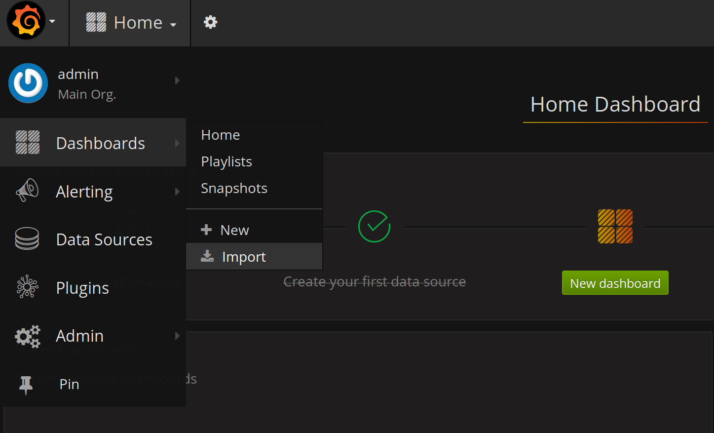
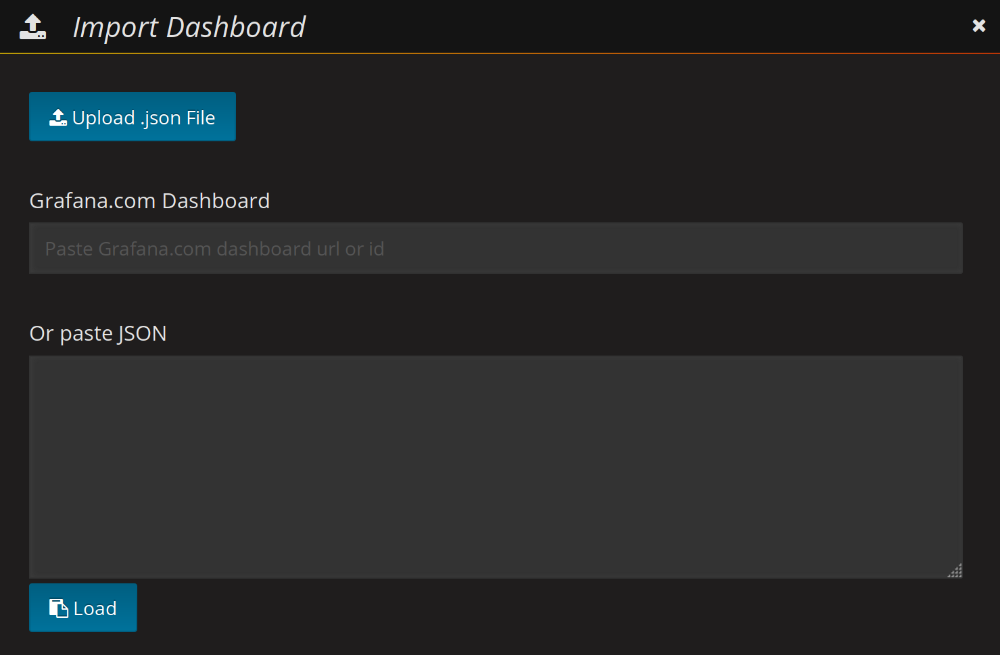
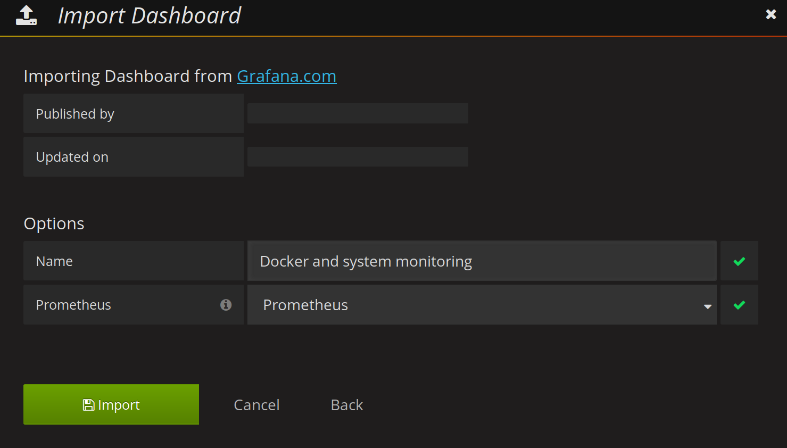
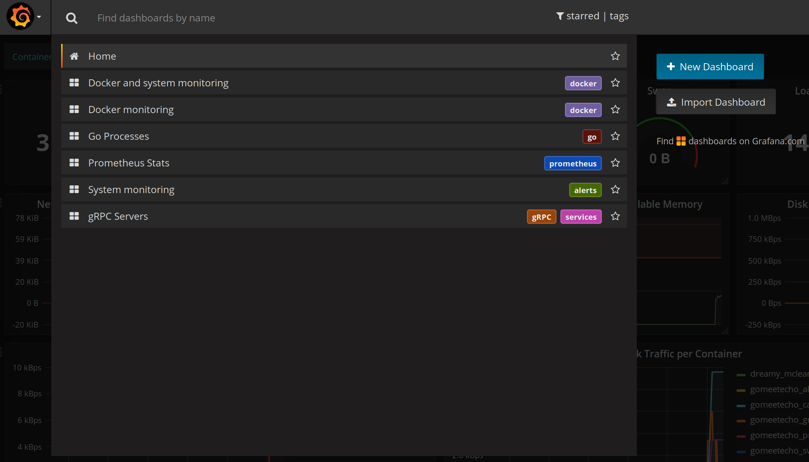

# Initalize Grafana loaded via docker-compose

When you launch svc-profile with Docker Compose (cf. [docker-compose.yml](../../docker-compose.yml)) a Grafana instance is launched.

To access it go to [http://&lt;Host IP Address&gt;:3000](http://<Host IP Address>:3000).

## Configuration

The `admin` password is set with `GF_SECURITY_ADMIN_PASSWORD` in [infra/config.monitoring](../../infra/config.monitoring) file.

## Post Configuration

Now we need to create the `Prometheus` Datasource in order to connect Grafana to Prometheus
* Click the `Grafana` Menu at the top left corner (looks like a fireball)
* Click `Data Sources`
* Click the green button `Add Data Source`
* The datasource `name` must be `Prometheus` (be careful, with a big `P`)
* `Http settings`
  * `Url` : `http;//localhost:9090`
  * `Access` choose `direct`

### Install Dashboards

Dashboards are in [infra/grafana/dashboards](../../infra/grafana/dashboards)

* [docker_and_system_monitoring.json](../../infra/grafana/dashboards/docker_and_system_monitoring.json) for docker and system monitoring in one dashboard
* [docker_monitoring.json](../../infra/grafana/dashboards/docker_monitoring.json) for docker monitoring (only)
* [go_Processes.json](../../infra/grafana/dashboards/go_Processes.json) for go processes monitoring
* [grpc_servers.json](../../infra/grafana/dashboards/grpc_servers.json) for grpc servers monitoring
* [prometheus_stats.json](../../infra/grafana/dashboards/prometheus_stats.json) for  prometheus monitoring
* [system_monitoring.json](../../infra/grafana/dashboards/system_monitoring.json) for system monitoring (only)

To import them, select `Grafana> Dashboards> Import` click on `Upload .json file` button and attach it to `Prometheus` datasource.

At the end you must have something like this :

### Alerting

Not Yet Implemented
